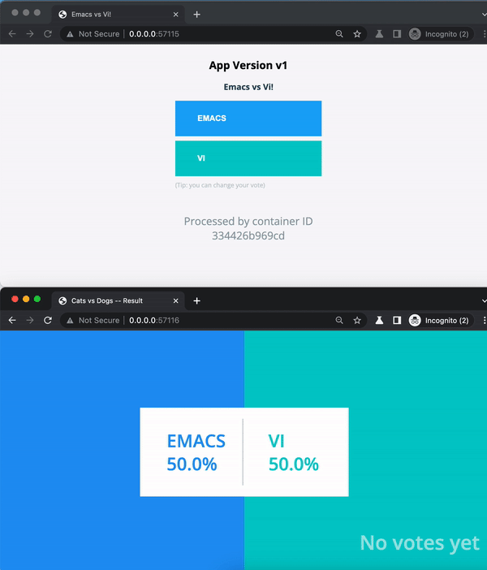

# Example Voting (Instavote) App

=========

## Getting started

This is a Polyglot application (python/node/java) that will be used to demonstrate
some of the common Continous Integration and Continous Delivery practices by leveraging
[Github Actions](https://docs.github.com/en/actions)](https://docs.github.com/en/actions).

## Architecture

* A Python webapp that lets you vote between two options
* A Redis queue that collects new votes
* A Java worker which consumes votes and stores them in…
* A Postgres database backed by a Docker volume
* A Node.js webapp that shows the results of the voting in real time

### Note

The voting application only accepts one vote per client. It does not register votes
if a vote has already been submitted by a client.

## Example

## Features

### Introduce Vote Application (python)

This introduces the workflow [python-app.yaml](.github/workflows/python-app.yaml)
that is triggered whenever a `pull_request` or `push` event is received. It performs
the next tasks

1. Checkout the source code
1. Setup Python 3.10
1. Install Package Dependencies and Auxiliary tools
1. Runs Linting and Style checks
1. Runs Automated Unit Tests
1. Checks for LeftOvers in the code

### Fix Linter Issues and Add Coverage Information

Fixing the first iteration of the code we added the next changes

1. Fix Linter findings for the `vote` application
1. Publish Test Results to the Action Run
1. Introduces `pytest-cov` to track Coverage information
1. Publish Coverage Data

### Add container builds for the `vote` application

The goal here is to introduce Docker builds for the application along with some other refactorings
to improve configurability.

1. Add `PYTHON_VERSION` to the workflow execution
1. Add `container` job to perform the next tasks
    1. Dependency on the build job
    1. Set Qemu for multi-arch builds
    1. Set BuildX for improved performance
    1. Local Build for Images (not pushing)

### Login to GitHub Container Registry

Introduce the faculty to push images to the GitHub registry:

1. Login to GitHub Container Registry
    1. Secrets are managed by GitHub via `secrets.GITHUB_TOKEN`
    1. Update the Taging and Push settings
